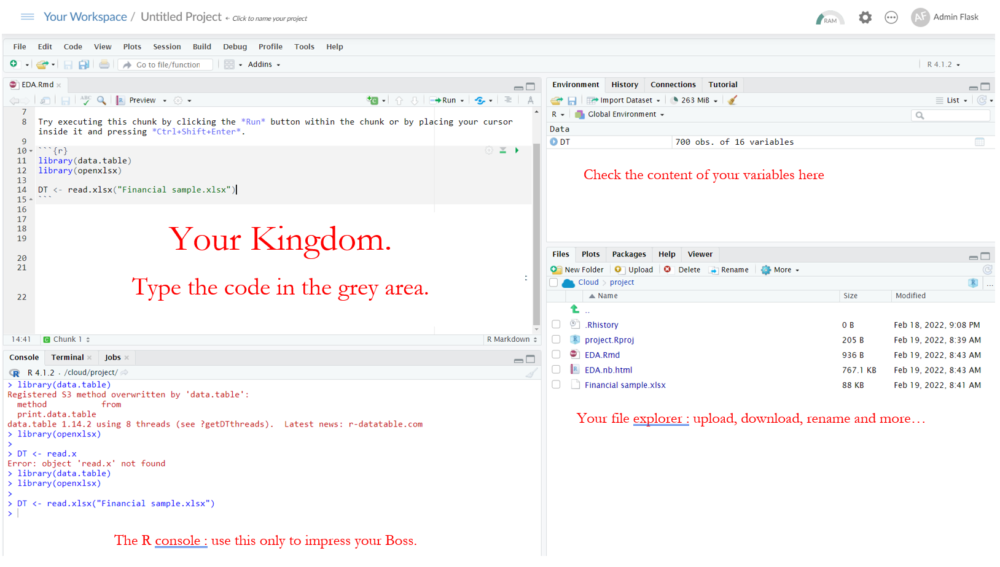

# Getting started 


For this course we will use RStudio, a graphic interface to work with R.
You have two options, and both are free :

- option 1 : use the **RStudio Cloud** version, which does not requires any program to install, as it runs in your browser.You can even use it on your tablet !
But RStudio Cloud (the free version) has limited computing resources, and your files are stored on an [US server](https://en.wikipedia.org/wiki/Patriot_Act).
^[Patriot Act : Under the act, US officials were granted access to any information physically within the United States (such as server farms), regardless of the information's origin. This meant that any information collected by an American server would have no protection from the US government.]
- option 2 : install **RStudio Desktop**, it is faster to use  and your data are stored on your computer.


## Option 1 : Start RStudio Cloud {-}


- go to  **https://rstudio.cloud**
- sign-up (you can use your gmail account)


## Option 2 : Install RStudio Desktop {-}

To use RStudio Desktop, you must first install R.

#### Install R {-}

- Open an internet browser and go to https://www.r-project.org.
- Click the **"download R"** link in the middle of the page under "Getting Started."
- Select a CRAN location (a mirror site) and click the corresponding link. Just choose any.
- Click on the **"Download R for Windows"** link at the top of the page.  
- Click on the **"install R for the first time"** link at the top of the page.
- Click **"Download R for Windows"** and save the executable file somewhere on your computer.
- Run the **.exe file** and follow the installation instructions.  

Now that R is installed, you need to download and install RStudio. 


#### Install RStudio {-}

- Go to https://www.rstudio.com and click on the "Download RStudio" button.
- Click on **"Download RStudio Desktop"**
- Click on the version recommended for your system, or the latest Windows version, and save the executable file.  
- Run the **.exe** file and follow the installation instructions. 
- start **RStudio Desktop**


### Create a new project {-}

- RStudio Cloud : once you land on the start page : `New Project` -> `New RStudio Project`
- RStudio Desktop : `File` -> `New Project` -> `New Directory` -> `New Project` -> name your project &  select the folder you want to save it ->`Create project`.

you're good to go !

### Overview of RStudio {-}
```{r pressure-plot, echo=FALSE ,  fig.cap='A RStudio project', fig.align='center', out.width='200%'}

```
