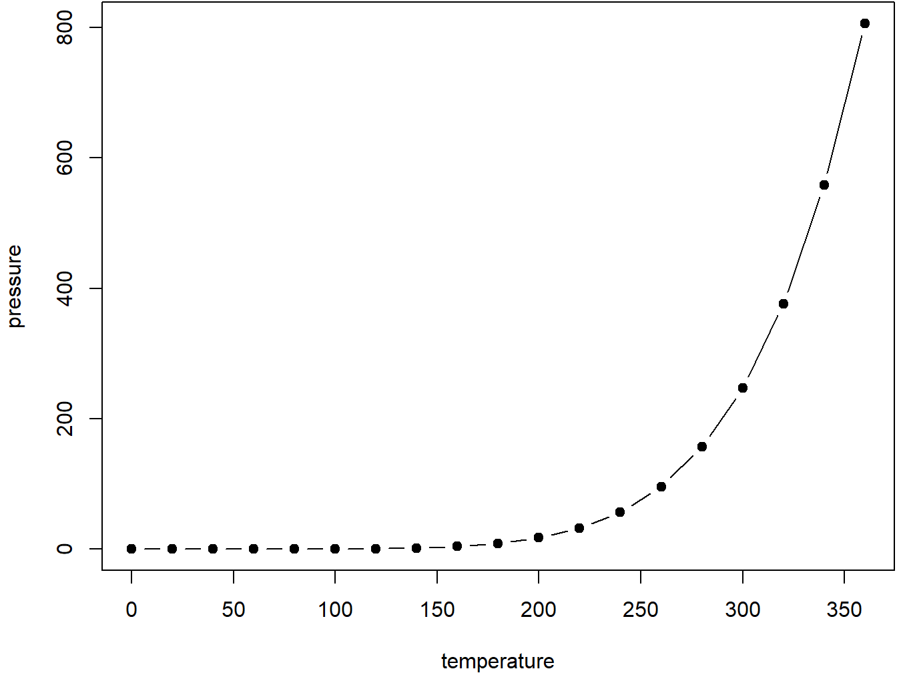

# Cross-references {#cross}

Cross-references make it easier for your readers to find and link to elements in your book.

## Chapters and sub-chapters

There are two steps to cross-reference any heading:

1. Label the heading: `# Hello world {#nice-label}`. 
    - Leave the label off if you like the automated heading generated based on your heading title: for example, `# Hello world` = `# Hello world {#hello-world}`.
    - To label an un-numbered heading, use: `# Hello world {-#nice-label}` or `{# Hello world .unnumbered}`.

1. Next, reference the labeled heading anywhere in the text using `\@ref(nice-label)`; for example, please see Chapter \@ref(cross). 
    - If you prefer text as the link instead of a numbered reference use: [any text you want can go here](#cross).

## Captioned figures and tables

Figures and tables *with captions* can also be cross-referenced from elsewhere in your book using `\@ref(fig:chunk-label)` and `\@ref(tab:chunk-label)`, respectively.

See Figure \@ref(fig:nice-fig).


```r
par(mar = c(4, 4, .1, .1))
plot(pressure, type = 'b', pch = 19)
```

<div class="figure" style="text-align: center">

<p class="caption">(\#fig:nice-fig)Here is a nice figure!</p>
</div>

Don't miss Table \@ref(tab:nice-tab).


```r
knitr::kable(
  head(pressure, 10), caption = 'Here is a nice table!',
  booktabs = TRUE
)
```


Table: (\#tab:nice-tab)Here is a nice table!

| temperature| pressure|
|-----------:|--------:|
|           0|   0.0002|
|          20|   0.0012|
|          40|   0.0060|
|          60|   0.0300|
|          80|   0.0900|
|         100|   0.2700|
|         120|   0.7500|
|         140|   1.8500|
|         160|   4.2000|
|         180|   8.8000|

# Parts

You can add parts to organize one or more book chapters together. Parts can be inserted at the top of an .Rmd file, before the first-level chapter heading in that same file. 

Add a numbered part: `# (PART) Act one {-}` (followed by `# A chapter`)

Add an unnumbered part: `# (PART\*) Act one {-}` (followed by `# A chapter`)

Add an appendix as a special kind of un-numbered part: `# (APPENDIX) Other stuff {-}` (followed by `# A chapter`). Chapters in an appendix are prepended with letters instead of numbers.


# Blocks

## Equations

Here is an equation.

\begin{equation} 
  f\left(k\right) = \binom{n}{k} p^k\left(1-p\right)^{n-k}
  (\#eq:binom)
\end{equation} 

You may refer to using `\@ref(eq:binom)`, like see Equation \@ref(eq:binom).


## Theorems and proofs

Labeled theorems can be referenced in text using `\@ref(thm:tri)`, for example, check out this smart theorem \@ref(thm:tri).

::: {.theorem #tri}
For a right triangle, if $c$ denotes the *length* of the hypotenuse
and $a$ and $b$ denote the lengths of the **other** two sides, we have
$$a^2 + b^2 = c^2$$
:::

Read more here <https://bookdown.org/yihui/bookdown/markdown-extensions-by-bookdown.html>.

## Callout blocks


The `bs4_book` theme also includes special callout blocks, like this `.rmdnote`.

::: {.rmdnote}
You can use **markdown** inside a block.


```r
head(beaver1, n = 5)
#>   day time  temp activ
#> 1 346  840 36.33     0
#> 2 346  850 36.34     0
#> 3 346  900 36.35     0
#> 4 346  910 36.42     0
#> 5 346  920 36.55     0
```

:::

It is up to the user to define the appearance of these blocks for LaTeX output. 

You may also use: `.rmdcaution`, `.rmdimportant`, `.rmdtip`, or `.rmdwarning` as the block name.


The R Markdown Cookbook provides more help on how to use custom blocks to design your own callouts: https://bookdown.org/yihui/rmarkdown-cookbook/custom-blocks.html
